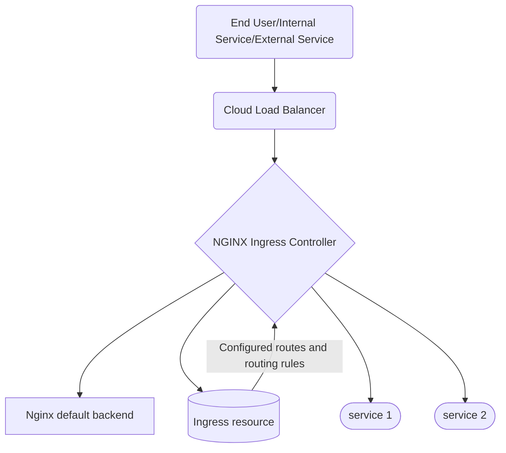

# Sprint 1 - Homework - "Putting it into practice"

## Re-Cap Objectives

- Identify one service your team supports
- Identify a small group (4-8) that supports this service
- Create a list of indicators, objectives, and agreements for this service
- Create a GitHub page for this service with a readme outlining the service, team, SLIs, SLOs and SLAs
- Present your service in the sprint retrospective 3 weeks from now

note: The team and I do not support any production services directly and it would take too much time to delve into our primary project namely Kubernetes, so the selected project is a supporting module namely the Nginx Ingress component. For the rest of this task, I will speak for the continued development and operational upkeep and on behalf of the consumer/operator.

## Overview

- Name: **terraform-lnrs-k8s-ingress-nginx** [Gitlab](https://gitlab.b2b.regn.net/terraform/official-modules/k8s/terraform-lnrs-k8s-ingress-nginx/)
- Kind: Terraform Module
- Summary: The module creates a NGINX Ingress Controller backed by a cloud load balancer on a Kubernetes cluster that has been created by using either the AWS or Azure Kubernetes modules.
- Support: Prikesh Patel, Dan Sossick, Peter Barr, Aydogan Osman, James Miller and Steve Hipwell.

## Diagram

The diagram is an abstract representation of the service.

## Detailed: Project Support & Service

### Development

- Respond, prioritise, categorise, and complete all new and existing project issues from architecture, security, and wider business teams.
- Release incremental versions of the module in line with the software development lifecycle when change is required.
- Follow the upstream [Nginx Ingress - open source project](https://github.com/kubernetes/ingress-nginx/releases/) and create and prioritise new issues based on major and minor releases and security matters.
- Follow the Cloud Providers for new features and deprecation and discuss them in scheduled meetings every sprint cycle.
- Follow the Infrastructure as Code delivery mechanism [Terraform] for bugs, major and minor releases and security concerns.
- Keep track of any upstream bugs that could affect the module functionality and discuss and escalate based on priority and risk.
- Provide, maintain and test demonstration code on a regular basis.

### Operational
